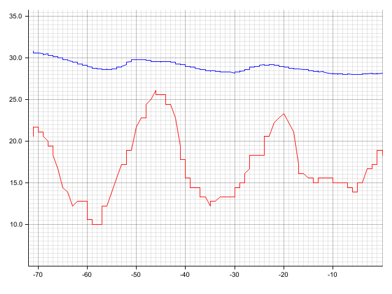

# temperature_grapher

This app reads a set of internal and external temperature data points for the
last number of given hours and plots it on a line graph.  The underlying data
is expected in a PostgreSQL database.  It is the complement to the
[`temperature_sensor`](https://github.com/linux2647/temperature_sensor)
package, which produces the data.

The app can be compiled with Rust 1.35 or later.  Earlier versions may be
possible, but they have not been tested.  The app has been tested on macOS and
Linux environments; other environments including Windows has not been tested.



## Database Schema

```sql
CREATE TABLE temperature (
    id serial NOT NULL PRIMARY KEY,
    internal real NOT NULL,
    external real NOT NULL,
    -- timestamps will be stored using UTC time zone
    datetime timestamp with time zone NOT NULL
);
```

## Operating Modes

The app has two different `main` functions but is configured to only compile
one in.  The selection of `main` function depends on if the app will run
standalone or in an AWS Lambda environment.

### Standalone

Building and running is standard:

```bash
cargo build  # or cargo build --release
cargo run
```

Running the program without any arguments, or an incomplete set of environment
variables, will display the usage message.

### AWS Lambda

Instead of writing the graph image to a file, the app stores the graph image in
S3.  The app will also write an `index.html` file in the root of the bucket to
assist serving the graph.

Building for the AWS Lambda environment is very particular and has been
simplified using Docker, utilizing the
[`clux/muslrust:stable`](https://hub.docker.com/r/clux/muslrust) image.  If
this is undesirable, please ensure there is a proper x86_64-unknown-linux-musl
(cross-compile) environment set up.

To build using Docker, run:

```bash
make lambda
```

This will produce a ZIP file in the project directory (`lambda.zip`) that is
ready for upload, compiled using release mode.  To build without Docker, build
with Cargo, targeting x86_64-unknown-linux-musl (recommended), and enable the
`aws-lambda` feature.

The Lambda requires the following environment variables to be set:

* `DB_HOST` PostgreSQL host
* `DB_USER` PostgreSQL user
* `DB_PASS` PostgreSQL password
* `DB_NAME` Database name
* `S3_BUCKET` Bucket to store the graph in S3
* `S3_PATH` S3 key for storing the graph

Optionals:
* `DB_PORT` PostgreSQL port; defaults to `5432`
* `HOURS` How many hours of data to display; must be a positive integer;
    defaults to `72`
* `PUBLIC` If set, sets the ACL to `public-read`.  **This means files will be 
    publicly available.**  Otherwise, the ACL is `private`
